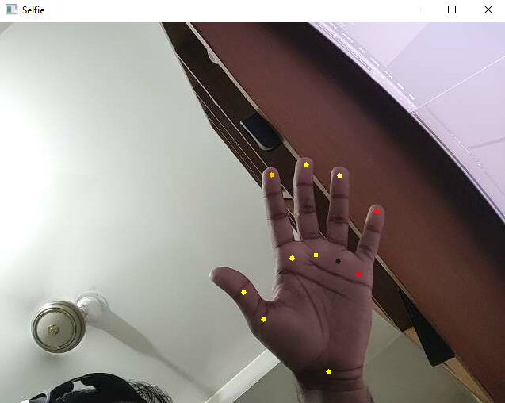
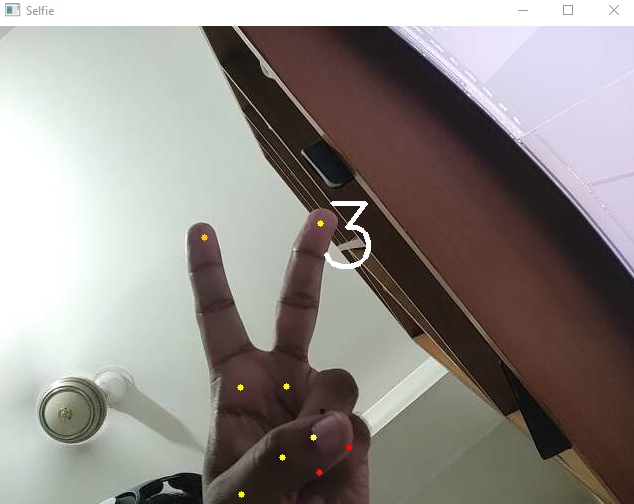

# Taking-Picture-Using-MediaPipe-Library

So here I used the MediaPipe Library in Python to develop a simple task of taking selfies using a webcam. If anyone uses a Victory sign ✌️ with their hand it will take a selfie on a countdown of 3.
Warning: Don't use the middle finger then you will be surprised 🤣.

## A Screenshot of Hand Detection using MediaPipe.

## Screenshot of countdown after showing the Victory sign✌️

